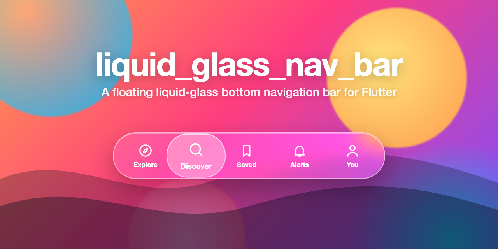
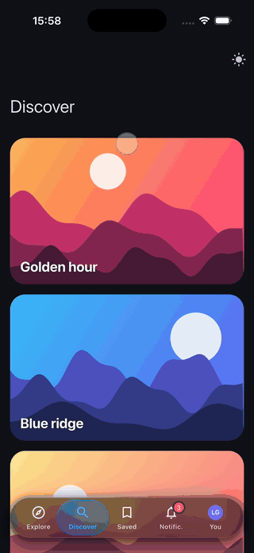
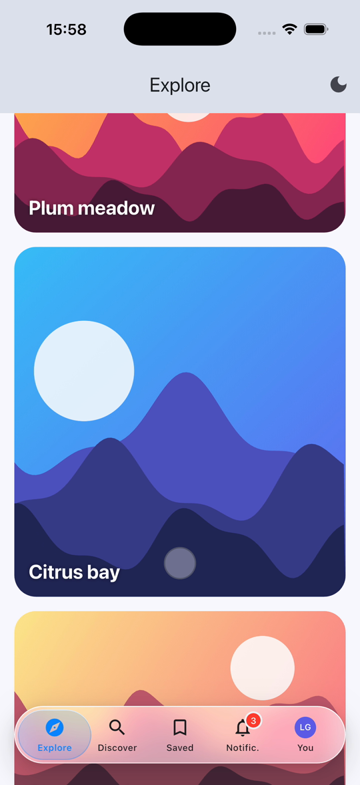
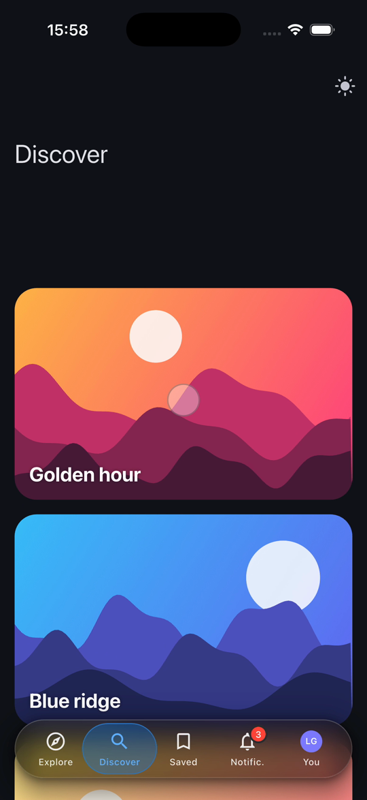
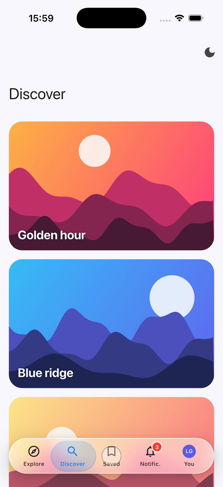
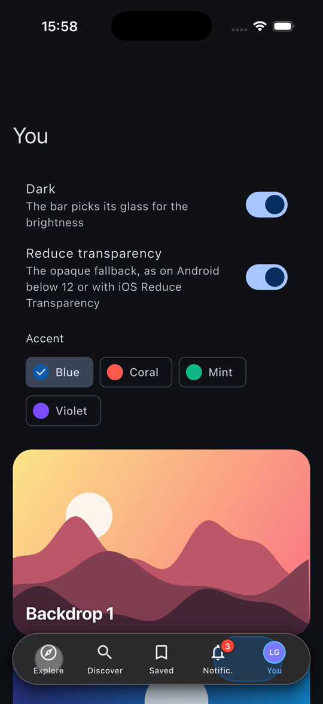

<p align="center">
  
</p>

# liquid_glass_nav_bar

[](https://github.com/frascella-dev/liquid-glass-nav-bar/actions/workflows/ci.yml)
[](LICENSE)

A floating bottom navigation bar of liquid glass for Flutter, the same on iOS and Android.
A capsule that blurs what scrolls under it, and a **lens** of glass that leaves for the item
you touch, swells under your finger, squeezes with its speed and lands on a spring, as iOS's
tab bar does. It looks after the people who cannot have glass: when the platform asks for
fewer effects, it becomes an opaque capsule.

<p align="center">
  
</p>

[Full video (MP4)](doc/demo.mp4)

<p align="center">
  
  
  
  
</p>

## Features

- The capsule floats 16 from the sides and 24 from the bottom; the screen scrolls under it.
- The lens is 12 wider than its slot and concentric with the capsule at both ends (4 gaps,
  radii 32 and 28).
- It moves on touch-down, swells 1.30x in height and 1.22x in width while moving, squeezes by
  its speed, and the whole bar grows 4 % under the finger.
- A drag follows the finger on springs; a fling above 900 px/s goes at most one item further.
- No ink: the lens is the only feedback. A focus ring shows from the keyboard, never on touch.
- Labels over nine characters are shortened with a period ("Notifications" reads "Notific.");
  the full label is spoken.
- Icons from any `IconData` or any widget, selected icons, count badges, an avatar item.
- Light and dark defaults, every colour and size configurable.
- Only transforms and paint move each frame, never layout.

## Install

```sh
flutter pub add liquid_glass_nav_bar
```

Until it is on pub.dev, depend on the repository:

```yaml
dependencies:
  liquid_glass_nav_bar:
    git: https://github.com/frascella-dev/liquid-glass-nav-bar.git
```

## Usage

```dart
import 'package:liquid_glass_nav_bar/liquid_glass_nav_bar.dart';

Scaffold(
  extendBody: true, // the body scrolls under the bar
  body: pages[index],
  bottomNavigationBar: LiquidGlassNavBar(
    selectedIndex: index,
    onSelected: (i) => setState(() => index = i),
    destinations: const [
      LiquidGlassDestination(
        icon: Icons.explore_outlined,
        selectedIcon: Icons.explore,
        label: 'Explore',
      ),
      LiquidGlassDestination(icon: Icons.search, label: 'Search'),
      LiquidGlassDestination(
        icon: Icons.notifications_none,
        selectedIcon: Icons.notifications,
        label: 'Alerts',
        badgeCount: 3,
      ),
      LiquidGlassDestination.avatar(label: 'You', initials: 'AB'),
    ],
    style: const LiquidGlassNavBarStyle(selectedColor: Color(0xFFFF5A4D)),
  ),
);
```

Give the body room for the bar: its bottom padding is `LiquidGlassNavBar.slotHeight` (88 with
the defaults) plus the bottom safe area. `example/` is a five-tab demo app over image-rich,
scrolling content, with a light/dark switch, the accent and the opaque fallback.

## Options

`LiquidGlassNavBar`

| Parameter | Type | What |
|---|---|---|
| `destinations` | `List<LiquidGlassDestination>` | Two to five places. |
| `selectedIndex` | `int` | The selected place. |
| `onSelected` | `ValueChanged<int>` | Called by a tap, a drag or a fling. |
| `style` | `LiquidGlassNavBarStyle?` | Overrides; null fields take the defaults. |
| `brightness` | `Brightness?` | Light or dark defaults; `Theme.of(context).brightness` if null. |

`LiquidGlassDestination`: `(icon, selectedIcon, label, badgeCount)`, `.widget(icon, selectedIcon,
label, badgeCount)` for any widget, `.avatar(label, image, initials, badgeCount)`.

`LiquidGlassNavBarStyle` (all optional; `.light()` and `.dark()` are the defaults)

| Field | Default | What |
|---|---|---|
| `height` | 64 | Capsule height. |
| `sideMargin` | 16 | From the sides (plus the safe area). |
| `bottomMargin` | 24 | From the bottom edge. |
| `iconSize` | 24 | Icons and avatar. |
| `blurSigma`, `saturation` | 20, 1.8 | The backdrop filter. |
| `glassColor`, `edgeColor`, `highlightColor` | white / smoked | Tint, edge line, top highlight. |
| `shadowColor`, `shadowNearColor` | black, soft | The two shadows. |
| `lensColor`, `lensEdgeColor`, `lensHighlightColor` | blue tint | The lens at rest. |
| `selectedColor`, `unselectedColor` | blue / ink | Icons and labels; also the avatar and focus rings. |
| `labelStyle`, `selectedLabelStyle` | 10 on 12, w500 / w600 | Labels. |
| `opaqueColor`, `opaqueBorderColor`, `opaqueLensColor` | | The opaque capsule. |
| `badgeColor`, `badgeTextColor`, `badgeRingColor` | red, white | Count badges. |
| `avatarColor`, `avatarForegroundColor` | | The avatar with initials. |
| `focusRingColor` | `selectedColor` | The keyboard focus ring. |

## Accessibility

The bar becomes an opaque capsule (a solid fill, a thin border, a solid lens that keeps the
press and drag feedback) when:

- **Android below 12 (API 31)**, where the blur is not available: `LiquidGlassPolicy(blurSupported: false)`;
- **iOS Reduce Transparency**: `LiquidGlassPolicy(reduceTransparency: true)`;
- **High contrast**, read from `MediaQuery`;
- **Reduce Motion / "Remove animations"**, read from `MediaQuery` and the platform: nothing
  swells, grows, squeezes or wobbles, and the lens jumps to the item.

Flutter does not report the first two, so the app reads them (a method channel, or
`device_info_plus` for the API level) and puts a policy above its navigation:

```dart
LiquidGlassPolicy(
  blurSupported: androidSdk >= 31,
  reduceTransparency: iosReduceTransparency,
  child: MaterialApp(...),
)
```

Every item is a button with its selected state and its count spoken, reachable from the keyboard.

## Platform notes

- The blur uses `BackdropFilter`. On Flutter's Impeller (iOS, and Android by default) it is
  fast; on Skia it costs more, so keep the content behind the bar light on old devices.
- Put the bar in a `Scaffold` with `extendBody: true`, or in a `Stack` at the bottom; the glass
  only shows something when there is content behind it.
- Left-to-right and right-to-left layouts are supported.
- Tested on iOS (simulator); Android and web follow Flutter's standard rendering.

## Licence

MIT, copyright frascella.dev. See [LICENSE](LICENSE).
